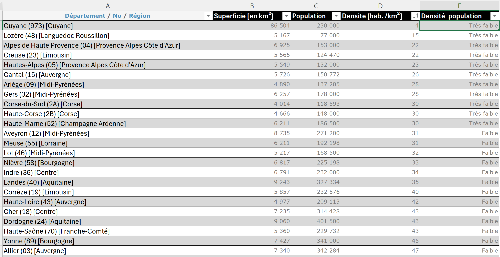
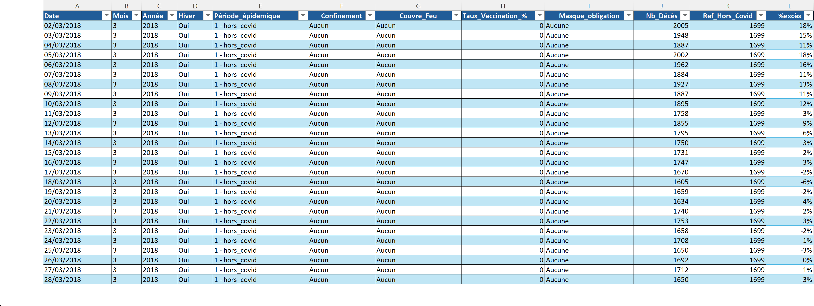
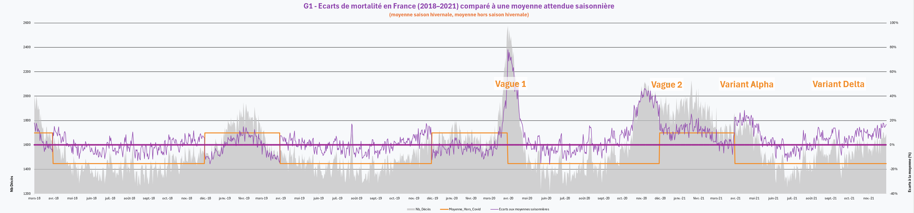
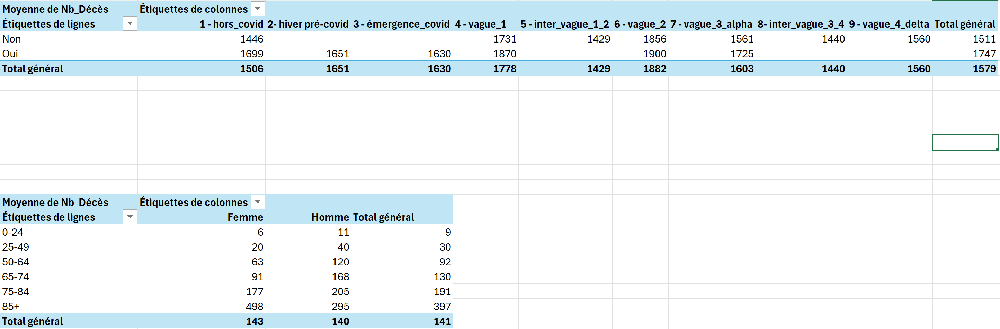
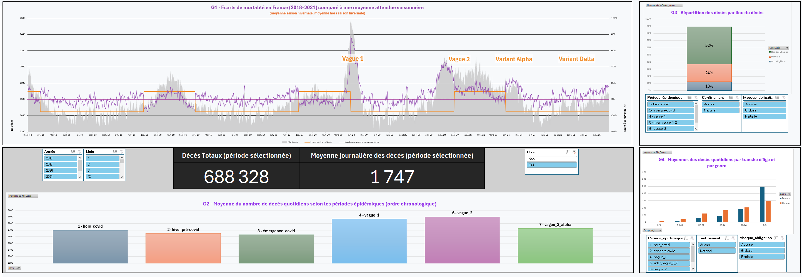
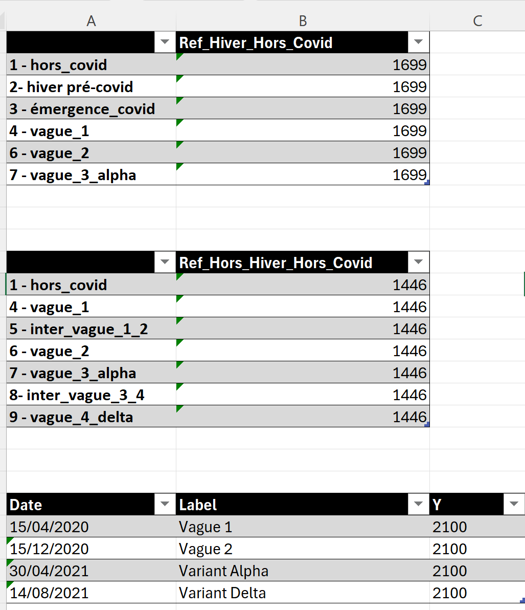
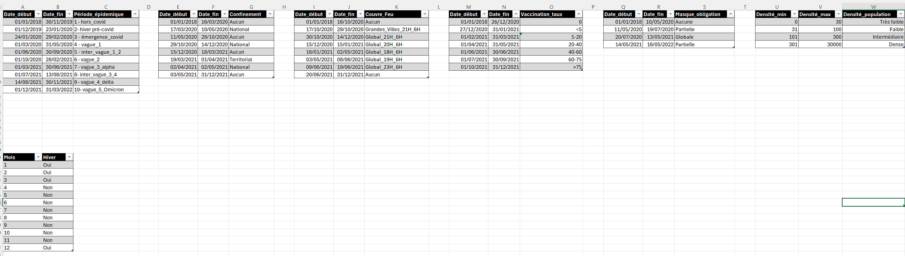
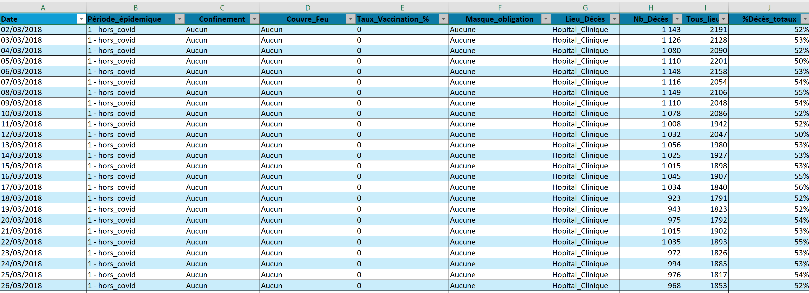
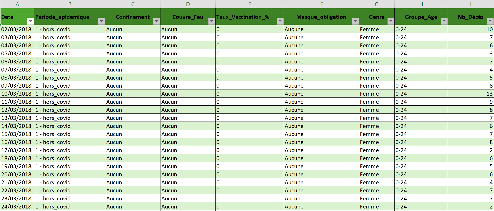
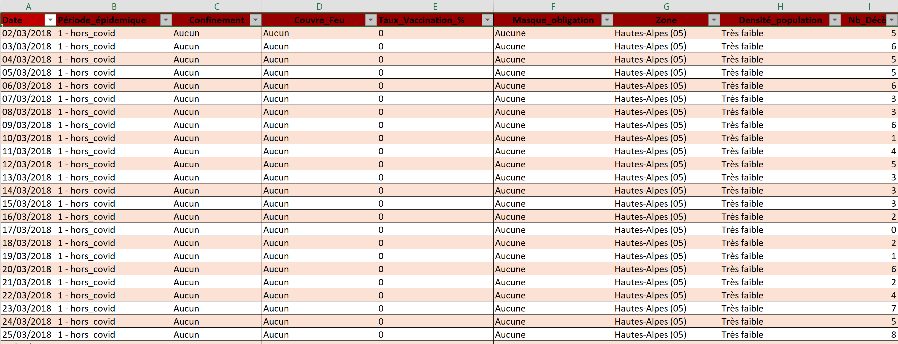

# Analyse de la mortalité en France pendant la période COVID (2018–2021)

## Contexte

Ce projet vise à analyser l’évolution de la mortalité en France entre 2018 et 2021, avec un focus particulier sur l’impact de la pandémie de COVID-19.

L’objectif est de comprendre comment la crise sanitaire a influencé la mortalité, en identifiant les variations temporelles, territoriales et démographiques.

---

## Problématique

La surmortalité observée en 2020-2021 en période COVID est-elle significative et atypique par rapport aux tendances historiques ?

---

## Données

Les données utilisées proviennent de sources publiques :

- Décès quotidiens dématérialisés en France — INSEE  
  https://www.insee.fr/fr/statistiques/4487854

Elles couvrent :

- la mortalité quotidienne
- les données par département
- les caractéristiques démographiques (âge, genre, lieu de décès)
- des éléments liés à la densité de population (urbain / rural)

EX : Table de référence départementale et densité de population

---

## Méthodologie

Le projet a été réalisé sous Excel avec les étapes suivantes :

- nettoyage et structuration des données
- construction de tables analytiques (globale, par lieu de décès, âge, genre et département)
- utilisation de tableaux croisés dynamiques
- création d’indicateurs comparatifs
- conception d’un dashboard interactif

Exemple de table analytique principale :

---

## Choix méthodologiques

### Visualisation des données brutes

Un graphique basé sur les totaux quotidiens bruts a été utilisé afin de restituer la chronologie directe des événements et mettre en évidence les ruptures marquantes.

### Lissage par moyennes

Les autres analyses reposent sur des données moyennes afin de :

- permettre une comparaison équitable entre périodes
- s’affranchir des différences de durée (notamment liées aux vagues COVID)
- stabiliser la lecture des tendances (axe Y lisible)
- faciliter l’utilisation de segments d’analyse

### Limites

- le lissage peut atténuer l’intensité réelle des pics
- une vague longue mais modérée peut apparaître moins significative

---

## Dashboard

Un dashboard interactif a été conçu pour permettre une analyse rapide :

- évolution temporelle de la mortalité
- analyse démographique (lieu de décès, âge, genre)
- indicateurs clés (décès totaux ou moyenne des décès sur les périodes sélectionnées à l'aide de segments dynamiques)

---

## Insights clés

Les analyses mettent en évidence plusieurs éléments importants :

- **Rupture de la saisonnalité historique**  
  Les pics de mortalité, historiquement concentrés en hiver, apparaissent hors saison hivernale en 2020 et 2021 (vagues COVID).

- **Anomalie renforcée par un hiver 2020 atypique**  
  L’hiver 2020 présente une mortalité inférieure aux années précédentes (probablement liée à une activité grippale plus faible), ce qui accentue le contraste avec la première vague COVID.

- **Impact fortement corrélé à l’âge**  
  La surmortalité devient significative à partir de 50-64 ans et augmente fortement avec l’âge, avec un impact maximal chez les 75+.

- **Effet indirect des restrictions sur les populations jeunes**  
  Une baisse notable des décès masculins est observée chez les 0-49 ans pendant les périodes de confinement et de couvre-feu.

---

## Conclusion

La surmortalité observée durant la pandémie est à la fois atypique dans sa temporalité et fortement concentrée sur les populations les plus âgées.

Aucun lien clair n’a pu être établi entre l’évolution de la mortalité et les mesures de protection (port du masque, vaccination, confinement, couvre-feu).  
Cela ne signifie pas qu’il n’existe pas de lien, mais que les analyses réalisées dans ce projet ne permettent pas d’observer de tendances claires à ce sujet. Cela pourrait faire l'objet d'une phase d'analyse ultérieure avec d'autres méthodologies: analyses multicritères avec calculs d'incertitude.

---

## Compétences mobilisées

- Excel avancé (tableaux croisés dynamiques, structuration, dashboard)
- Analyse de données
- Construction d’indicateurs
- Lecture critique des résultats
- Mise en évidence des tendances

---

## Illustrations complémentaires

### Éléments de construction du dashboard

Données catégorielles utilisées pour structurer l'analyse :

### Tables analytiques complémentaires

